  <strong>Molecular Docking Pipeline for Predicting Influenza Host Shifts</strong>

  

<h1 align="center">DOKKEN</h1>
Guided molecular docking pipeline with automated bounding box generation and filtering using convoluted neural network. 

## DOKKEN PIPELINE

```mermaid
flowchart LR
    %% Layout spacing
    linkStyle default stroke-width:2px

    %% Nodes
    A["Predict Receptor Structure<br/>OpenFold3"]
    B["Compute Interface Prior<br/>ML - PyTorch"]
    C["Rosetta Side-Chain Optimization"]
    D["Bounding Box and Flexible Residue Selection"]
    E["Vina Docking"]
    F["Voxelize Docked Poses"]
    G["CNN Pose Filtering and Ranking"]
    H["Select Top Poses<br/>Relative Affinity Analysis"]

    %% Subgraphs for cleaner grouping
    subgraph STRUCTURE
        A --> B --> C
    end

    subgraph DOCKING
        C --> D --> E --> F
    end

    subgraph ML_FILTERING
        F --> G --> H
    end

    %% Styling
    classDef structure fill:#E3F2FD,stroke:#1E88E5,stroke-width:2px,color:#0D47A1;
    classDef docking fill:#E8F5E9,stroke:#43A047,stroke-width:2px,color:#1B5E20;
    classDef ml fill:#F3E5F5,stroke:#8E24AA,stroke-width:2px,color:#4A148C;

    class A,B,C structure;
    class D,E,F docking;
    class G,H ml;
```

