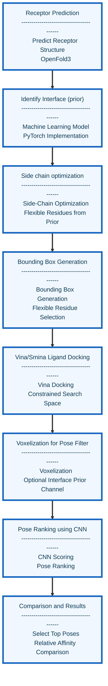

##  <h1 align="center">Molecular Docking Pipeline for Predicting Influenza Host Shifts</h1>

  

<h1 align="center"></h1>
Guided molecular docking pipeline with automated bounding box generation feature and ranked pose filtering by convoluted neural network. 

## <h1 align="center">Pipeline Workflow </h1>

