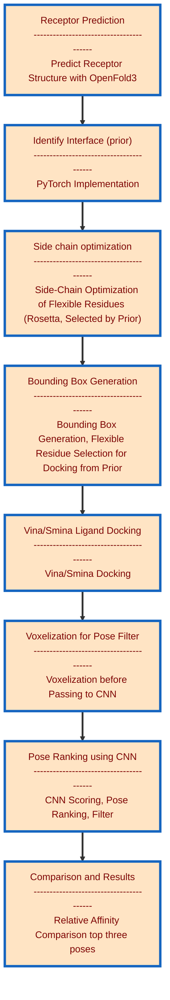

##  <h1 align="center">Molecular Docking Pipeline for Predicting Influenza Host Shifts</h1>

  

<h1 align="center"></h1>
Guided molecular docking pipeline with automated bounding box generation feature and ranked pose filtering by convoluted neural network. 

## <h1 align="center">Pipeline Workflow </h1>

Dokken is a pilot study intended to test the efficacy of _in silico_ surveillance methodology for risk assessment of host switching events, _before they happen. _ Several canonical studies have shown the requirement of adaptive mutations increasing the affinity of binding to human receptor isomers of glycated sialic acid receptors (Neu-2,6)-glyc over the isomer commonly found in the bird receptors (Neu-2,3)-glyc in the hemagglutinin receptor of influenza with primary host endemicity in birds. In simple terms, transmission in humans is facilitated by mutations that increase affinity to the human receptor. This project aims to take advantage of key advances in protein structural modeling prediction using OpenFold3, coupled with advanced optimization of side chain conformations in the receptor binding site and flexible residue docking with ranked poses and filtering by convolutional neural network algorithms. The pipeline is high throughput and predicts the binding site in openfold generated structures based on graph neural network training of a model to identify the site of the binding interface from a database of crystal structures. This interface is then used to automate the bounding box used to limit the docking region and identify sites within the binding interface necessary for sidechain energy minimization efforts in Rosetta. Automated identification of the bounding box and side chains required to be optimized and flexible are the pain points that require manual intervention in most docking pipelines. This is intended to be modular and the approach can be reproduced for other receptors and antibody: antigen interfaces. 

